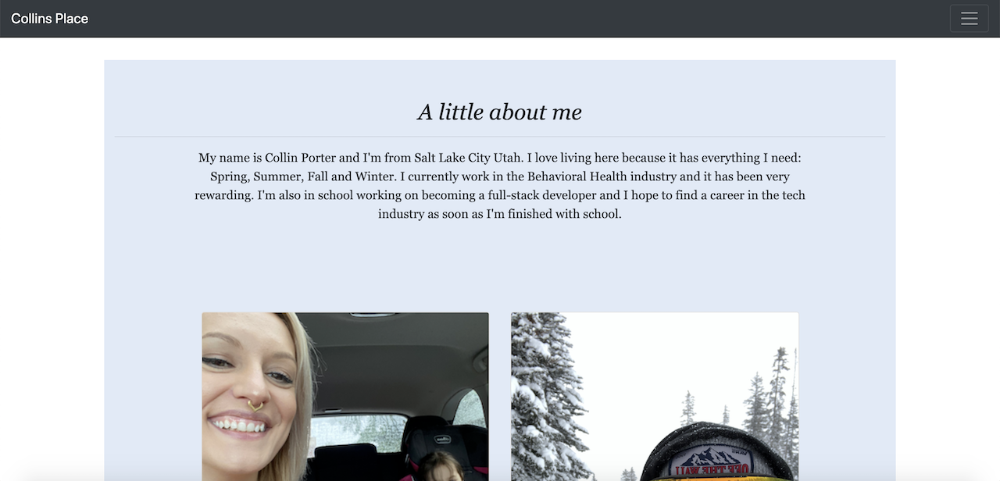
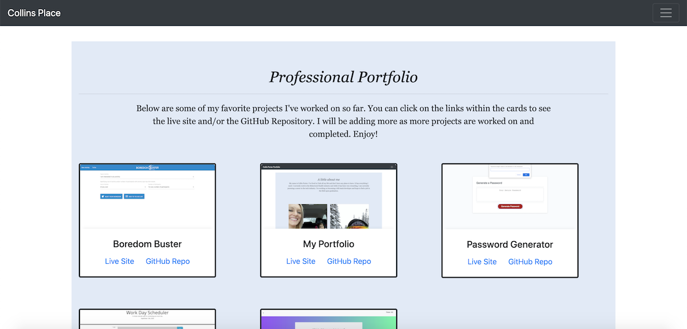
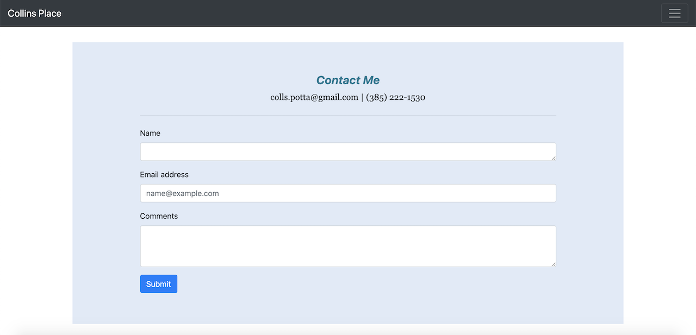

# Collin Porter Portfolio

This application features 3 pages:
1. The first section or "About Me" is where I show a few different images of my favorite things.
2. The second section or "Professional Portfolio" is where I have some examples of different homework assignments and projects I've worked on. 
3. The third section or "Contact Me" is where I have email and phone number listed and the user can add a name, email and comments in different input boxed to send me a message.

Link to live site: [Collins Porfolio](https://portercol.github.io/Collin-Porter-Portfolio/)

# Credits/Technologies Used

1. Bootstrap CDN
2. GOOGLE
3. TAs / Tutors
4. HTML5
5. Basic CSS