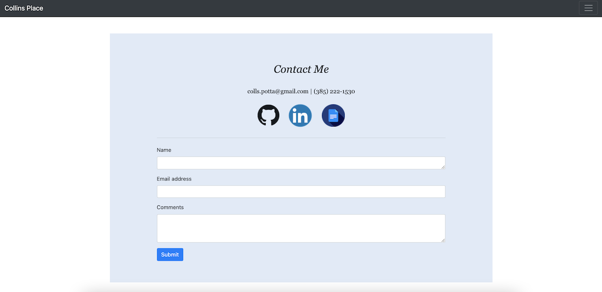

# Collin Porter Portfolio

Link to live site: [My Porfolio](https://portercol.github.io/Collin-Porter-Portfolio/)

## Description

This application features 3 pages:
1. The 'About Me' section I show a few different images with descriptions of my favorite things.
2. The 'Professional Portfolio' section I display my professional Web Development projects I've worked on and completed with links to the live sites and the GitHub repo. 
3. The 'Contact Me' section I have links to my GitHub, LinkedIn, Professional Resume, and a contact box for emails.

## App images
1. About Me

2. Professional Portfolio

3. Contact Me

## Credits/Technologies

1. Bootstrap CDN
2. HTML5
3. CSS